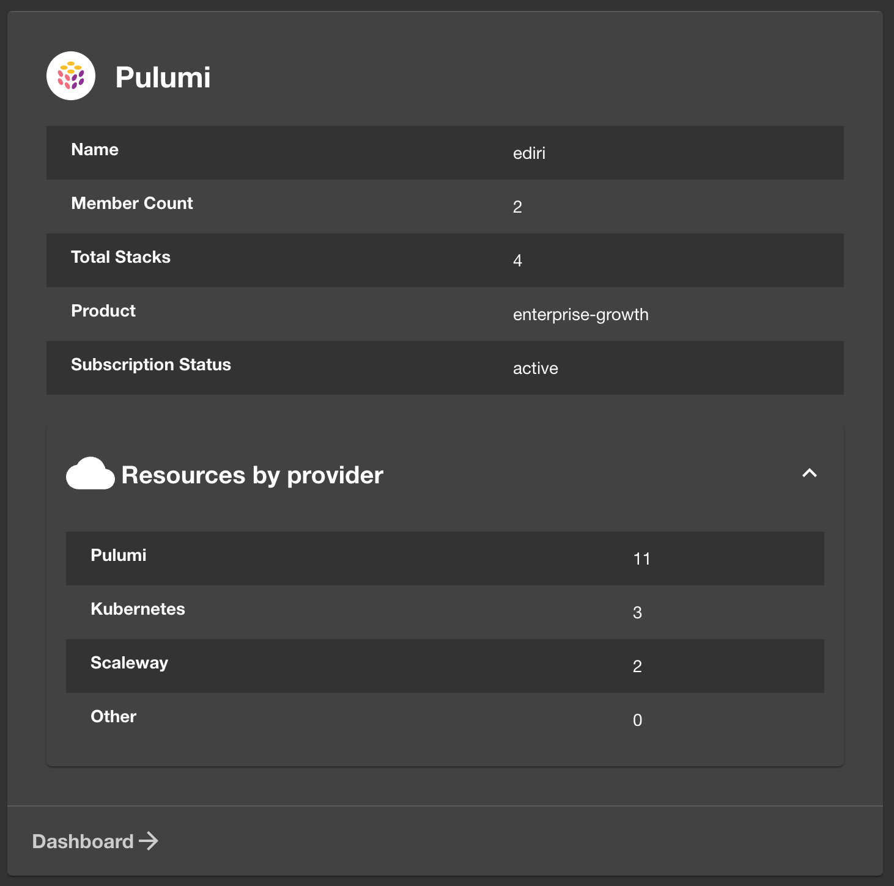

# Pulumi

This repository contains plugins and modules for [Backstage](https://backstage.io/) to
support [Pulumi](https://www.pulumi.com/).

> **NOTE:** This is a work in progress and happy to receive feedback and contributions.

This repository contains the following Backstage plugins and modules:

- [Pulumi Scaffolder Backend Module](#pulumi-scaffolder-backend-module)
- [Pulumi Plugin](#pulumi-plugin)

## Pulumi Scaffolder Backend Module

### Requirements

#### Pulumi CLI

You need to have the Pulumi CLI installed on the Backstage server.

If you use the Backstage Dockerfile, add following lines before the `USER node` line:

```Dockerfile
RUN --mount=type=cache,target=/var/cache/apt,sharing=locked \
    --mount=type=cache,target=/var/lib/apt,sharing=locked \
    apt-get update && \
    apt-get install -y --no-install-recommends curl ca-certificates
```

and add following lines after the `USER node` line:

```Dockerfile
RUN <<EOF
## Install pulumi and set to PATH
curl -fsSL https://get.pulumi.com | sh
EOF

ENV PATH="/node/.pulumi/bin:${PATH}"
````

This will install the latest Pulumi CLI to your Backstage container.

#### Pulumi Personal Access Token (PAT)

To authenticate to the Pulumi cloud service, you need to provide additionally the Pulumi Personal Access Token via the
environment variable `PULUMI_ACCESS_TOKEN``

#### Programming languages runtimes

If you're not going to use the [Pulumi Deployment](https://www.pulumi.com/docs/pulumi-cloud/deployments/) service, you need
to be sure that all the programming language runtimes are installed on your Backstage service

### Getting Started

You need to configure the action in your backend:

### From your Backstage root directory

```bash
# From your Backstage root directory
yarn add --cwd packages/backend @pulumi/backstage-scaffolder-backend-pulumi
```

Configure the action (you can check
the [docs](https://backstage.io/docs/features/software-templates/writing-custom-actions#registering-custom-actions) to
see all options):

```typescript
// packages/backend/src/plugins/scaffolder.ts
import {
    pulumiNewAction,
    pulumiUpAction
} from '@pulumi/backstage-scaffolder-backend-pulumi';

const actions = [
    pulumiNewAction(),
    pulumiUpAction(),
    ...createBuiltinActions({
        integrations,
        catalogClient,
        config: env.config,
        reader: env.reader,
    })
]

return await createRouter({
    actions,
    logger: env.logger,
    config: env.config,
    database: env.database,
    reader: env.reader,
    catalogClient,
    identity: env.identity,
    permissions: env.permissions,
});
```

### PULUMI_ACCESS_TOKEN

You need to set the `PULUMI_ACCESS_TOKEN` environment variable to be able to use the Pulumi action.

### Pulumi New Action

The Pulumi New Action is a custom action that allows you to create a new Pulumi project from a template.

`pulumi:new`

| Input        | Description                                                                        | Type          | Required |
|--------------|------------------------------------------------------------------------------------|---------------|----------|
| stack        | The Pulumi stack to use                                                            | string        | Yes      |
| organization | The Pulumi organization to use for the Pulumi commands                             | string        | Yes      |
| name         | The Pulumi project name to use                                                     | string        | Yes      |
| template     | The Pulumi template to use, this can be a built-in template or a URL to a template | string        | Yes      |
| description  | The Pulumi project description to use                                              | string        | Yes      |
| config       | The Pulumi project config to use                                                   | object        | No       |
| secretConfig | The Pulumi project secret config to use                                            | object        | No       |
| args         | The Pulumi command arguments to run                                                | array(string) | No       |
| folder       | The folder to run Pulumi in                                                        | string        | Yes      |

```yaml
apiVersion: scaffolder.backstage.io/v1beta3
kind: Template
metadata:
  name: kubernetes-template
  title: Kubernetes Cluster
  description: |
    A template for creating a new Kubernetes Cluster.
  tags:
  - pulumi
  - kubernetes
spec:
  steps:
  - id: pulumi-new-component
    name: Cookie cut the component Pulumi project
    action: pulumi:new
    input:
      name: "${{ parameters.component_id }}-infrastructure"
      description: ${{ parameters.description | dump }}
      organization: ediri
      stack: ${{ parameters.stack }}
      template: "https://github.com/my-silly-organisation/microservice-civo/tree/main/infrastructure-${{ parameters.cloud }}-${{ parameters.language }}"
      config:
        "node:node_count": "${{ parameters.nodeCount }}"
      folder: .
```

### Pulumi Up Action

The Pulumi Up Action is a custom action that allows you to run the `pulumi up` command.

`pulumi:up`

| Input                      | Description                                                         | Type          | Required |
|----------------------------|---------------------------------------------------------------------|---------------|----------|
| stack                      | The Pulumi stack to use                                             | string        | Yes      |
| organization               | The Pulumi organization to use for the Pulumi commands              | string        | Yes      |
| name                       | The Pulumi project name to use                                      | string        | Yes      |
| deployment                 | This flag indicates that Pulumi Deployment will be used             | boolean       | Yes      |
| config                     | The Pulumi project config to use                                    | object        | No       |
| secretConfig               | The Pulumi project secret config to use                             | object        | No       |
| outputs                    | The Pulumi project outputs to return                                | array(string) | No       |
| repoUrl                    | The Pulumi project repo URL to use, when using Pulumi Deployment    | string        | No       |
| repoBranch                 | The Pulumi project repo branch to use, when using Pulumi Deployment | string        | No       |
| repoProjectPath            | The Pulumi project repo path to use, when using Pulumi Deployment   | string        | No       |
| providerCredentialsFromEnv | The Pulumi project provider credentials to use                      | array(string) | No       |
| preRunCommands             | The Pulumi project pre-run commands to run                          | array(string) | No       |

The action offers also Pulumi deployment support, to use it you need to set the `deployment` input to `true`. If you did
not set any `config` or `secretConfig`, during the `pulumi:new` action, you need to set them here. If you have any
provider related credentials, you need to set the `providerCredentialsFromEnv` input.

```yaml
apiVersion: scaffolder.backstage.io/v1beta3
kind: Template
metadata:
  name: kubernetes-template
  title: Kubernetes Cluster
  description: |
    A template for creating a new Kubernetes Cluster.
  tags:
  - pulumi
  - kubernetes
spec:
  steps:
  - id: pulumi-deploy-infrastructure
    name: Deploy the infrastructure using Pulumi CLI
    action: pulumi:up
    input:
      deployment: false
      name: "${{ parameters.component_id }}-infrastructure"
      repoUrl: "https://github.com/${{ (parameters.repoUrl | parseRepoUrl)['owner'] }}/${{ (parameters.repoUrl | parseRepoUrl)['repo'] }}"
      repoProjectPath: .
      organization: ediri
      outputs:
      - kubeconfig
      - ClusterId
      stack: ${{ parameters.stack }}
```

> [!NOTE]
> If you run `pulumi:up` via CLI and with a local Pulumi template you may need to install the required dependencies for
> the Pulumi SDK to work. This can now be done via the `preRunCommands` input.
> For example for a node based Pulumi project you need to run `npm install` before running `pulumi up`.

## Pulumi Plugin

- Display relevant Pulumi information about an entity within Backstage, such as the Pulumi stack, organization, project
  name, and project description.
- Show the Pulumi activity view for an entity within Backstage.

### Requirements

- Setup of the Pulumi plugin for Backstage requires a Pulumi Organization admin to generate a Pulumi access token for
  the Backstage application.

### Feature Overview

#### Pulumi Card (Component Overview)


#### Pulumi Card (System Overview)



#### Pulumi Activity View


### Support

If you need any help with this plugin, feel free to reach out to me!

### Integration Walk-through

#### Install the plugin

The file paths mentioned in the following steps are relative to your app's root directory — for example, the directory
created by following the [Getting Started](https://backstage.io/docs/getting-started/) guide and creating your app with
`npx @backstage/create-app`.

First, install the Pulumi plugin via a CLI:

```bash
# From your Backstage root directory
yarn add --cwd packages/app @pulumi/backstage-plugin-pulumi
```

Next, add the plugin to `EntityPage.tsx` in `packages/app/src/components/catalog` by adding the following code snippets.

Add the following imports to the top of the file:

```tsx
import {
    isPulumiAvailable,
    EntityPulumiCard,
    EntityPulumiMetdataCard,
    PulumiComponent
} from '@pulumi/backstage-plugin-pulumi';
```

Then create a new constant for the Pulumi Component:

```tsx
const pulumiContent = (
    <EntitySwitch>
        <EntitySwitch.Case if={isPulumiAvailable}>
            <PulumiComponent/>
        </EntitySwitch.Case>
    </EntitySwitch>
);
```

Find const `overviewContent` in `EntityPage.tsx`, and add the following snippet inside the outermost Grid defined there,
just before the closing `</Grid>` tag:

```tsx
<EntitySwitch>
    <EntitySwitch.Case if={isPulumiAvailable}>
        <Grid item md={6}>
            <EntityPulumiCard variant="gridItem"/>
        </Grid>
    </EntitySwitch.Case>
</EntitySwitch>
```

Now find the `serviceEntityPage` constant in `EntityPage.tsx`, and add the following snippet inside:

```tsx
<EntityLayout.Route path="/pulumi" title="Pulumi" if={isPulumiAvailable}>
    {pulumiContent}
</EntityLayout.Route>
```

Lastly, find the `systemPage` constant in `EntityPage.tsx`, and add the following snippet inside after the
closing `</Grid>` tag of the `<EntityAboutCard variant="gridItem" />`:

```tsx
  <EntitySwitch>
    <EntitySwitch.Case if={isPulumiAvailable}>
        <Grid item md={6}>
            <EntityPulumiMetdataCard/>
        </Grid>
    </EntitySwitch.Case>
</EntitySwitch>
```

#### Configure the plugin

First, annotate your component/resource entity with the following:

```yaml
annotations:
  pulumi.com/project-slug: [Pulumi Cloud Name: org/stackname/stack]
```

And your system entity with the following:

```yaml
annotations:
  pulumi.com/orga-slug:
    <Pulumi Cloud: org>
```

Next, provide the API token that the client will use to make requests to the Pulumi Cloud API.

Add the proxy configuration in `app-config.yaml`:

```yaml
proxy:
  '/pulumi':
    target: 'https://api.pulumi.com/api'
    changeOrigin: true
    headers:
      Authorization: token ${PULUMI_ACCESS_TOKEN}
      Accept: application/vnd.pulumi+8
      Content-Type: application/json
```

Then, start the backend, passing the Pulumi Access Token as an environment variable:

```bash
export PULUMI_ACCESS_TOKEN='<PULUMI_ACCESS_TOKEN>' 
yarn start
```

This will proxy the request by adding an `Authorization` header with the provided token.

#### How to Uninstall

1. Remove any configuration added in Backstage yaml files, such as the proxy configuration in `app-config.yaml` and the
   integration key in an entity's annotations.
1. Remove the added code snippets from `EntityPage.tsx`
1. Remove the plugin package:

```bash
# From your Backstage root directory
yarn remove --cwd packages/app @pulumi/backstage-plugin-pulumi
```
